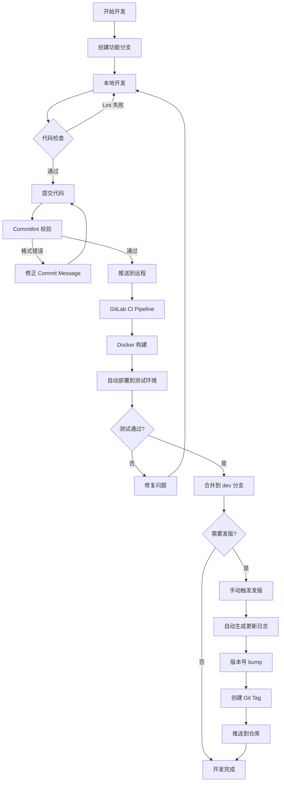
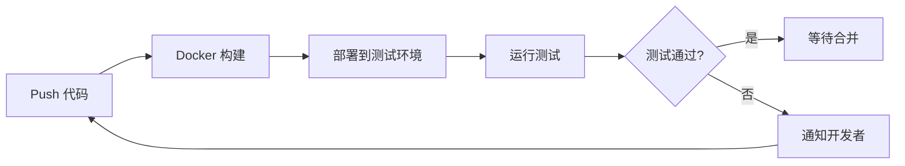
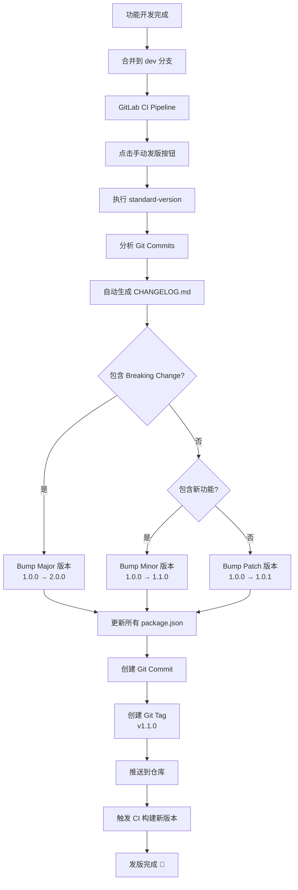
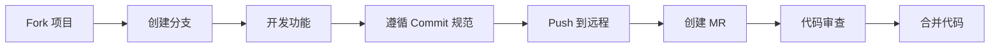

# YSS UI

<p align="center">
  
</p>

<h1 align="center">YSS UI</h1>

<p align="center">
  基于 Vue 3、Ant Design Vue 与 VXE-Table 的企业级中后台组件库
</p>

<p align="center">
  <a href="https://ycwang-dev.github.io/yss-ui">📖 在线文档</a> •
  <a href="#快速开始">🚀 快速开始</a> •
  <a href="#开发流程">💻 开发流程</a> •
  <a href="#发版流程">📦 发版流程</a>
</p>

---

## ✨ 特性

- 🎨 **开箱即用** - 基于 Ant Design Vue 和 VXE-Table 封装的企业级组件
- 📦 **Monorepo 架构** - 清晰的包结构：`@yss-ui/components`、`@yss-ui/hooks`、`@yss-ui/utils`
- 🔧 **TypeScript 支持** - 完整的类型定义
- 🎯 **模块化设计** - 组件、Hooks、工具函数独立发布
- 📝 **完善的文档** - 详细的 API 文档和丰富的示例
- 🔄 **自动化发版** - 基于 Conventional Commits 的自动化版本管理
- 🚀 **CI/CD 集成** - GitHub Actions 自动化门禁与发版

## 📦 包含的模块

```
yss-ui/
├── @yss-ui/components  # 组件库（Table、Formily、Monaco、Tree 等）
├── @yss-ui/hooks       # Hooks 库（useFullscreen、useLoading 等）
├── @yss-ui/utils       # 工具函数库（formatDate、downloadBlob 等）
└── @yss-ui/theme       # 主题配置
```

## 🚀 快速开始

### 环境要求

- Node.js >= 22.10.0
- pnpm >= 8.6.0

### 安装

```bash
# 克隆项目
git clone https://github.com/ycwang-dev/yss-ui.git

# 进入项目目录
cd yss-ui

# 安装依赖
pnpm install

# 启动开发服务器
pnpm dev
```

访问 http://localhost:8000 查看文档。

### 在项目中使用

#### 1. 安装组件库

可以直接通过公共 npm 源安装：

```bash
# 安装组件库与配套包
pnpm add @yss-ui/components @yss-ui/hooks @yss-ui/utils
```

```typescript
// 在 Vue 3 项目中使用
import { YTable, YFormily } from '@yss-ui/components';
import { useFullscreen, useLoading } from '@yss-ui/hooks';
import { formatDate, downloadBlob } from '@yss-ui/utils';
```

---

## 💻 开发流程

### 完整开发流程图



### 1. 创建功能分支

```bash
# 拉取最新代码
git pull origin dev

# 创建功能分支（建议命名：feature-xxx 或 fix-xxx）
git checkout -b feature-new-component
```

### 2. 本地开发

```bash
# 启动开发服务器
pnpm dev

# 在 packages/ 目录下进行开发
# - packages/components/  组件开发
# - packages/hooks/       Hooks 开发
# - packages/utils/       工具函数开发

# 编写文档（docs/ 目录）
# 编写 Demo（docs/*/demos/ 目录）
```

**开发规范**：
- 遵循 [组件开发规范](.agent/yss-ui-development-standards.md#组件开发规范)
- 组件超过 150 行必须模块化拆分
- 使用 TypeScript 严格模式
- 为所有公共 API 编写 JSDoc 注释

### 3. 代码检查

```bash
# 运行 Lint
pnpm lint              # ESLint 检查
pnpm lint:style        # Stylelint 检查
pnpm type-check        # TypeScript 类型检查

# 修复 Lint 错误
pnpm lint --fix
```

### 4. 提交代码（重要 ⭐）

**Commit Message 规范**（必须遵守）：

```bash
# 格式：<type>(<scope>): <subject>

# ✅ 正确示例
git commit -m "feat(@yss-ui/components): Table 新增虚拟滚动功能"
git commit -m "fix(@yss-ui/hooks): useFullscreen 修复 iOS 兼容性"
git commit -m "docs(components): 更新 Table API 文档"

# ❌ 错误示例
git commit -m "add new feature"        # 缺少 type 和 scope
git commit -m "feat(table): 新功能。"   # scope 错误，有句号
```

**Type 类型**：
- `feat` - 新功能
- `fix` - Bug 修复
- `docs` - 文档更新
- `style` - 代码格式调整
- `refactor` - 重构
- `perf` - 性能优化
- `test` - 测试相关
- `build` - 构建相关
- `ci` - CI 配置
- `chore` - 其他杂项

**Scope 范围**：
- `@yss-ui/components` 或 `components`
- `@yss-ui/hooks` 或 `hooks`
- `@yss-ui/utils` 或 `utils`
- `@yss-ui/theme` 或 `theme`
- `docs`、`scripts`、`config`、`deps`

**自动校验**：
- Husky 会在 commit 时自动校验格式
- 不符合规范的 commit 会被拒绝

### 5. 推送代码

```bash
# 推送到远程
git push origin feature-new-component

# 在 GitLab 创建 Merge Request
# 选择目标分支：dev
```

### 6. GitLab CI 自动化



**CI Pipeline 阶段**：

1. **docker** - 构建 Docker 镜像
   - 使用 Node 22.19.0 环境
   - 执行 `pnpm build`
   - 推送镜像到 Harbor

2. **deploy** - 部署到测试环境
   - 拉取最新镜像
   - 启动容器
   - 健康检查

3. **release** - 发版（手动触发）
   - 生成更新日志
   - 更新版本号
   - 创建 Git Tag

### 7. 代码审查与合并

```bash
# 在 GitLab UI 中
1. 创建 Merge Request
2. 等待代码审查
3. 通过后合并到 dev 分支
```

---

## 📦 发版流程

### 自动化发版流程图



### 本地发版（推荐）

```bash
# 1. 确保在 dev 分支且代码最新
git checkout dev
git pull origin dev

# 2. 选择发版类型
pnpm release:patch   # 1.0.0 -> 1.0.1 (Bug 修复)
pnpm release:minor   # 1.0.0 -> 1.1.0 (新功能)
pnpm release:major   # 1.0.0 -> 2.0.0 (破坏性更新)

# 3. 脚本自动执行：
#    - 分析 commit 历史
#    - 生成 docs/changelog.md
#    - 更新所有 package.json 版本号
#    - 创建 commit 和 tag

# 4. 手动更新分包日志 (可选)
#    - docs/changelog/hooks.md
#    - docs/changelog/components.md
#    - docs/changelog/utils.md

# 5. 检查生成的日志
git diff HEAD~1 docs/changelog.md

# 5. 推送到远程
git push --follow-tags origin dev
```

### GitLab CI 发版

**前提条件**：配置环境变量
- `GITLAB_USER_NAME` - Git 提交者名称
- `GITLAB_USER_EMAIL` - Git 提交者邮箱
- `GIT_LAB_PUSH_TOKEN` - GitLab 推送凭证

**步骤**：

1. 在 GitLab UI 进入项目的 CI/CD → Pipelines
2. 找到最新的 pipeline
3. 点击 `should_run_release_ci` 阶段的手动按钮
4. 设置 `BUMP` 变量：
   - `patch` - 补丁版本（默认）
   - `minor` - 次版本
   - `major` - 主版本
   - `auto` - 自动检测
5. 等待 CI 自动完成发版

### 版本号规则（Semantic Versioning）

```
主版本号.次版本号.补丁版本号
   |       |       |
   |       |       └─ Bug 修复（向下兼容）
   |       └───────── 新功能（向下兼容）
   └───────────────── 破坏性更新（不兼容）

示例：
v1.0.0 -> v1.0.1  # 修复 bug
v1.0.1 -> v1.1.0  # 新增功能
v1.1.0 -> v2.0.0  # API 重大变更
```

---

## 🔧 常用命令

### 开发相关

```bash
pnpm dev                    # 启动开发服务器
pnpm build                  # 构建文档
pnpm build:components       # 构建所有 packages
pnpm preview                # 预览构建后的文档
```

### 代码质量

```bash
pnpm lint                   # 运行 ESLint
pnpm lint:style             # 运行 Stylelint
pnpm type-check             # TypeScript 类型检查
pnpm test                   # 运行测试
```

### 工具脚本

```bash
pnpm generate:llms          # 生成 AI 工具集成文档
```

### 发版

```bash
pnpm release:patch          # 发布补丁版本
pnpm release:minor          # 发布次版本
pnpm release:major          # 发布主版本
```

---

## 📚 文档

### 开发文档

- [开发规范](.agent/yss-ui-development-standards.md) - 完整的开发规范和最佳实践
- [发版工作流](docs/guide/release-workflow.md) - 详细的发版流程和 Commit 规范
- [GitLab CI 集成](docs/guide/gitlab-ci-integration.md) - CI/CD 配置说明
- [AI 工具集成 · Skills 技能同步](docs/guide/ai-skills.md) - 把开发规范装进业务项目
- [AI 工具集成 · MCP Server 查询](docs/guide/mcp.md) - AI 按需精准查询组件 API 与 Demo
- [AI 工具集成 · LLMs.txt 全量文档](docs/guide/llms.md) - 全量文档喂给 AI（兜底）

### 在线文档

访问 [https://ycwang-dev.github.io/yss-ui](https://ycwang-dev.github.io/yss-ui) 查看：
- 📖 组件文档和 API 说明
- 🎯 实战示例和最佳实践
- 🔧 配置指南
- 📝 更新日志

---

## 🤝 贡献指南

### 开发流程总结



### 提交规范检查清单

- [ ] Commit message 遵循 Conventional Commits 规范
- [ ] 类型（type）使用正确的枚举值
- [ ] 范围（scope）指定了正确的包名
- [ ] 描述（subject）简洁明了，不超过 100 字符
- [ ] 没有以句号结尾
- [ ] 通过了 Husky commit-msg hook 校验

### 代码审查要点

- [ ] 代码符合项目规范
- [ ] 组件模块化拆分合理
- [ ] TypeScript 类型定义完整
- [ ] 有完善的文档和示例
- [ ] 通过了所有 CI 检查
- [ ] Commit message 规范正确

---

## 🚨 常见问题

### Q: Commit 被拒绝了怎么办？

A: Commit message 格式不正确。请参考 [发版工作流](docs/guide/release-workflow.md) 中的规范。

```bash
# 查看错误信息
# 通常会提示哪里不符合规范

# 修正后重新提交
git commit -m "feat(@yss-ui/components): 正确的格式"
```

### Q: 如何跳过 CI 检查？

A: 在 commit message 中添加 `[skip ci]`：

```bash
git commit -m "chore: 更新 README [skip ci]"
```

### Q: 本地发版失败了怎么办？

A: 检查以下几点：
1. 是否在正确的分支（dev/main）
2. 本地代码是否最新
3. 是否有未提交的变更
4. package.json 版本号是否正确

回滚错误的发版：
```bash
git reset --hard HEAD~1
git tag -d v1.0.1
git push origin :refs/tags/v1.0.1
```

### Q: 如何查看 CI 日志？

A: 在 GitLab 项目页面 → CI/CD → Pipelines → 点击相应的 job 查看日志。

---

## 📊 项目结构

```
yss-ui/
├── .agent/                      # AI 开发规范
│   └── yss-ui-development-standards.md
├── .husky/                      # Git Hooks
│   └── commit-msg               # Commit 校验
├── packages/                    # Monorepo 包
│   ├── components/              # 组件库
│   ├── hooks/                   # Hooks 库
│   ├── utils/                   # 工具函数库
│   └── theme/                   # 主题配置
├── docs/                        # 文档
│   ├── components/              # 组件文档
│   ├── hooks/                   # Hooks 文档
│   ├── utils/                   # 工具函数文档
│   ├── guide/                   # 指南
│   └── changelog/               # 更新日志
│       ├── components.md        # 组件库日志
│       ├── hooks.md             # Hooks 日志
│       └── utils.md             # 工具库日志
├── scripts/                     # 脚本
│   ├── ci-release.sh            # CI 发版脚本
│   └── generate-llms.js         # AI 文档生成
├── .commitlintrc.js             # Commitlint 配置
├── .versionrc.js                # Standard-version 配置
├── .gitlab-ci.yml               # GitLab CI 配置
└── README.md                    # 项目说明
```

---

## 🔗 相关链接

- 📖 [在线文档](https://ycwang-dev.github.io/yss-ui)
- 🔧 [GitHub 仓库](https://github.com/ycwang-dev/yss-ui)
- 🎨 [Ant Design Vue](https://www.antdv.com/)
- 📊 [VXE Table](https://vxetable.cn/)
- 📝 [Conventional Commits](https://www.conventionalcommits.org/)
- 🏷️ [Semantic Versioning](https://semver.org/lang/zh-CN/)

---

## 📄 许可证

MIT

---

## 👥 维护团队

如有问题，请联系项目维护者或在 GitLab 创建 Issue。
