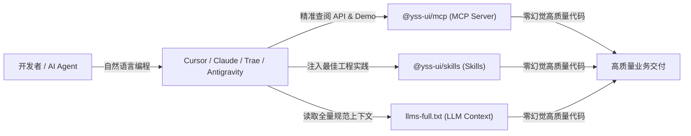
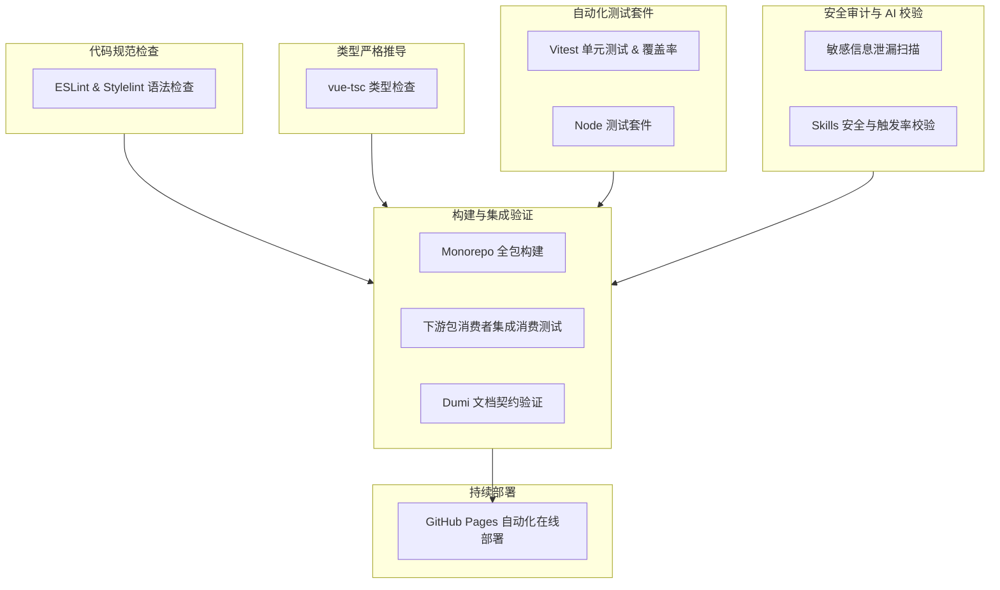

<p align="center">
  
</p>

<h1 align="center">YSS UI</h1>

<p align="center">
  <b>基于 Vue 3、Ant Design Vue 与 VXE-Table 的企业级中后台前端工程与组件库体系</b>
</p>

<p align="center">
  内置高性能表格 / 动态表单 / 自适应布局 Hooks / 主题 Token 系统，并原生提供领先的 AI 研发智能体套件（MCP & Skills）
</p>

<p align="center">
  <a href="https://github.com/iamyancong/yss-ui/actions/workflows/ci.yml">
    
  </a>
  <a href="https://iamyancong.github.io/yss-ui">
    
  </a>
  <a href="https://github.com/iamyancong/yss-ui/blob/main/LICENSE">
    
  </a>
  <a href="https://nodejs.org">
    
  </a>
  <a href="https://pnpm.io">
    
  </a>
  <a href="https://github.com/iamyancong/yss-ui/pulls">
    
  </a>
</p>

<p align="center">
  <a href="https://iamyancong.github.io/yss-ui">📖 在线文档</a> •
  <a href="#-核心特性">✨ 核心特性</a> •
  <a href="#-模块架构">📦 模块架构</a> •
  <a href="#-快速开始">🚀 快速开始</a> •
  <a href="#-ai-原生生态集成">🤖 AI 生态</a> •
  <a href="#-开源协作流程">💻 协作流程</a> •
  <a href="#️-ci-自动化门禁与发版">🛡️ 门禁与发版</a>
</p>

---

## ✨ 核心特性

- 📊 **企业级表格与行内编辑**：基于 `vxe-table 4.x` 深度封装的 `YTable` 与 `YEditTable`，开箱即用支持海量数据虚拟滚动、服务端分页、行拖拽排序、单元格动态校验、下拉选项联动与列设置持久化。
- 📝 **复杂表单与联动生态**：基于 `@formily/vue 2.x` + Ant Design Vue 深度整合的 `YFormily`，支持 JSON Schema 驱动、字段级异步联动（`x-reactions`）、新增/编辑/查看三态自由切换与自适应网格布局。
- 📐 **自适应布局 Hooks**：提供 `@yss-ui/hooks`（如 `useTableHeight`、`useTreeHeight` 等），彻底解决中后台复杂嵌套布局中的双滚动条、高度塌陷与视口抖动问题。
- 🎨 **企业级动态主题**：内置 `@yss-ui/theme`，支持 Ant Design 动态 Token 派生、CSS 变量映射、暗色模式及品牌主色即时切换。
- 🤖 **领先的 AI 原生研发套件**：
  - **Model Context Protocol (MCP)**：官方提供 `@yss-ui/mcp` Server，支持 AI 智能体实时精准检索组件 API 与真实代码示例，拒绝大模型幻觉。
  - **AI Skills 规范注入**：通过 `@yss-ui/skills` 与 `@yss-ui/skills-cli`，一键将组件库开发规范、CRUD 模板与最佳实践注入 Cursor、Claude、Trae 等 AI 辅助工具。
  - **LLMs.txt 标准支持**：原生导出符合标准的 `llms.txt` / `llms-full.txt` 上下文文档。
- ⚡ **坚实的现代工程底座**：采用 TypeScript 严格模式、pnpm Workspaces Monorepo 多包管理、Vitest 单元测试覆盖与严苛的 CI 质量门禁。

---

## 📦 模块架构

YSS UI 采用 **pnpm Monorepo** 架构管理各个独立子包，按职责分层解耦，支持独立构建与增量发布：

| 子包目录 | npm 包名 | 职责与定位 |
| :--- | :--- | :--- |
| `packages/components` | [`@yss-ui/components`](packages/components) | **核心组件库**：包含 YTable、YFormily、YEditTable、YTree、YButton、YCard、YDescriptions、YMonacoEditor 等组件 |
| `packages/hooks` | [`@yss-ui/hooks`](packages/hooks) | **组合式 API 库**：`useTableHeight`、`useTreeHeight`、`useFullscreen`、`useLoading`、`useModal` 等业务 Hooks |
| `packages/utils` | [`@yss-ui/utils`](packages/utils) | **通用工具库**：格式化、日期处理、树形转换、Blob 文件下载（`handleBlobResponse`、`downloadBlob`）等 |
| `packages/theme` | [`@yss-ui/theme`](packages/theme) | **主题与 Token 配置**：CSS 变量、Design Token 派生方案及主题样式规则 |
| `packages/mcp` | [`@yss-ui/mcp`](packages/mcp) | **AI MCP 服务**：供智能体按需调用的 Model Context Protocol Server，提供组件文档与 Demo 精准检索 |
| `packages/skills` | [`@yss-ui/skills`](packages/skills) | **AI 业务技能库**：涵盖 CRUD 规范、Formily 联动、表格开发、主题应用等全流程 AI 指引规范 |
| `packages/skills-cli` | [`@yss-ui/skills-cli`](packages/skills-cli) | **AI 技能同步工具**：一键将官方 Skills 同步部署至业务项目或个人全局 AI IDE 的命令行工具 |

---

## 🚀 快速开始

### 运行环境准备

在开始之前，请确保本地已满足以下环境要求：
- **Node.js**：`>= 22.10.0`
- **pnpm**：`>= 8.6.0`

### 1. 在 Vue 3 业务项目中使用

直接通过 npm / pnpm 安装所需的子包：

```bash
# 安装核心组件库、Hooks 与工具包
pnpm add @yss-ui/components @yss-ui/hooks @yss-ui/utils @yss-ui/theme
```

在组件中引入并使用：

```vue
<script setup lang="ts">
import { ref } from 'vue';
import { YTable, YButton } from '@yss-ui/components';
import { useTableHeight } from '@yss-ui/hooks';
import { formatDate } from '@yss-ui/utils';

// 自适应表格高度计算
const { tableHeight } = useTableHeight({ extraOffset: 48 });

const columns = [
  { field: 'name', title: '名称', width: 200 },
  { 
    field: 'createTime', 
    title: '创建时间', 
    formatter: ({ cellValue }) => formatDate(cellValue, 'YYYY-MM-DD HH:mm:ss') 
  }
];

const tableData = ref([
  { id: '1', name: 'YSS UI Enterprise', createTime: Date.now() }
]);
</script>

<template>
  <div class="page-container">
    <YTable
      :columns="columns"
      :data="tableData"
      :height="tableHeight"
    />
  </div>
</template>
```

---

### 2. 参与源码开发与文档预览

克隆仓库并启动本地 Dumi 文档开发环境：

```bash
# 1. 克隆代码仓库
git clone https://github.com/iamyancong/yss-ui.git
cd yss-ui

# 2. 安装项目全部依赖
pnpm install

# 3. 启动开发文档服务
pnpm dev
```

本地服务启动后，在浏览器访问 `http://localhost:8000` 即可浏览全量组件交互文档与实时 Demo。

---

## 🤖 AI 原生生态集成

YSS UI 是业界首批为 **AI-Assisted Coding（智能体辅助编程）** 提供系统级支持的前端组件库。



### 1. AI 技能同步 (@yss-ui/skills-cli)
将官方沉淀的企业级 CRUD 模板、Formily 规范与 Token 规则直接同步到业务项目或本机的 AI IDE 中：

```bash
# 同步 Skills 到当前项目和支持的 AI IDE（Cursor、Trae、Claude 等）
pnpm sync:skills

# 仅同步到本机用户级全局 AI 目录
pnpm sync:skills:ides
```

### 2. 官方 MCP Server (@yss-ui/mcp)
配置 `@yss-ui/mcp` 服务后，AI 智能体即可在对话中调用内置工具（如 `get_component_docs`、`get_demo`、`search_docs`），实现 **“查阅为先，拒绝猜测”** 的可靠生成。

### 3. LLMs 上下文支持
可直接向大模型投喂在线全量文档：
- **全量上下文文档**：[https://iamyancong.github.io/yss-ui/llms-full.txt](https://iamyancong.github.io/yss-ui/llms-full.txt)
- **文档索引导航**：[https://iamyancong.github.io/yss-ui/llms.txt](https://iamyancong.github.io/yss-ui/llms.txt)

---

## 💻 开源协作流程

我们非常欢迎社区贡献者参与到 YSS UI 的建设中！推荐遵循标准的 GitHub 工作流：


### 1. 分支规范
- 主开发分支统一为 **`main`**。
- 贡献分支命名建议：
  - 新功能：`feature/component-name` 或 `feat/xxx`
  - 修复缺陷：`fix/issue-description`
  - 文档调整：`docs/update-xxx`

### 2. Commit Message 提交规范 (Conventional Commits)
本项目配置了 Husky 与 Commitlint 强制门禁，提交信息必须严格遵循以下格式：

```
<type>(<scope>): <subject>
```

- **Type 类型**：
  - `feat`: 新增功能 / 新组件
  - `fix`: 修复缺陷
  - `docs`: 文档变更
  - `style`: 代码格式调整（不影响逻辑）
  - `refactor`: 代码重构（非新增功能也非修复 bug）
  - `perf`: 性能优化
  - `test`: 单元测试补充或修复
  - `build`: 构建打包或依赖配置
  - `ci`: CI / CD 流程调整
  - `chore`: 其他非源码变动的辅助事务

- **Scope 范围**（对齐 Monorepo 包名）：
  - `@yss-ui/components` (或 `components`)
  - `@yss-ui/hooks` (或 `hooks`)
  - `@yss-ui/utils` (或 `utils`)
  - `@yss-ui/theme` (或 `theme`)
  - `@yss-ui/mcp` (或 `mcp`)
  - `@yss-ui/skills` (或 `skills`)
  - `@yss-ui/skills-cli` (或 `skills-cli`)
  - `docs`, `scripts`, `config`, `deps`

**提交示例**：
```bash
# ✅ 正确提交示例
git commit -m "feat(@yss-ui/components): YTable 新增行拖拽排序支持"
git commit -m "fix(@yss-ui/hooks): useTableHeight 修复视口极值场景抖动"
git commit -m "docs(components): 补充 YFormily 动态联动 demo"

# ❌ 错误示例（将被 git hook 拦截拒绝）
git commit -m "update table"          # 缺少 type 与 scope
git commit -m "feat(table): 新功能。"  # 包含中文句号，scope 非标准包名
```

---

## 🛡️ CI 自动化门禁与发版

### 1. GitHub Actions CI 质检网络

每次向 `main` 分支提交代码或创建 Pull Request 时，[CI Pipeline](.github/workflows/ci.yml) 将自动并行触发 5 道严格的防护门禁：



---

### 2. 多包增量发版机制 (Release Packages to npm)

YSS UI 采用 **自动化精准发版策略**，各子包独立维护语义化版本（Semantic Versioning）：

#### 🚀 GitHub Actions 一键发版
拥有发版权限的维护者可在 GitHub 页面直接触发发版工作流：
1. 访问仓库 **Actions** ➔ **[Release Packages to npm](.github/workflows/release.yml)**。
2. 点击 **Run workflow**。
3. 选择版本升级步长：`patch`（补丁）、`minor`（次版本）或 `major`（主版本）。
4. （可选）勾选 `dry_run` 进行试运行预览，检查版本变更与待发包清单而不实际推送。
5. 工作流将自动执行：
   - 运行 `pnpm quality` 全量质量门禁；
   - 自动运行 `scripts/release-changed.js` 检测仅有改动的子包；
   - 更新子包版本号与各自分包的 `changelog.md`；
   - 构建并将对应子包公开发布到 npm 官方镜像源；
   - 自动创建 Git Tag 与 Commit 推回仓库，并发送发版通知。

#### 💻 本地发版辅助命令
在本地环境也可利用内置脚本进行便捷的变更检测与发版：

```bash
# 智能检测改动子包并进行 Patch 升级 (1.0.0 -> 1.0.1)
pnpm release:smart:patch

# 智能检测改动子包并进行 Minor 升级 (1.0.0 -> 1.1.0)
pnpm release:smart:minor

# 预览变更（Dry Run 模式，不影响任何实际文件）
node scripts/release-changed.js patch --dry
```

---

## 🔧 常用开发命令清单

| 命令 | 描述 |
| :--- | :--- |
| **本地开发与构建** | |
| `pnpm dev` | 准备前置数据并启动 Dumi 开发文档服务（端口 8000） |
| `pnpm build` | 构建并修复生产环境静态文档站点产物 |
| `pnpm build:components` | 构建 Monorepo 下所有的 packages 子包源码 |
| `pnpm preview` | 预览本地构建后的文档站点 |
| **代码质量与测试** | |
| `pnpm lint` | 运行 ESLint 并自动修复代码格式 |
| `pnpm lint:style` | 运行 Stylelint 并自动修复样式格式 |
| `pnpm type-check` | 运行 `vue-tsc` 进行严格 TypeScript 类型检查 |
| `pnpm test:unit` | 运行 Vitest 单元测试 |
| `pnpm test:coverage` | 运行单元测试并输出测试覆盖率报告 |
| `pnpm test:package-consumer` | 构建组件并运行下游消费端模拟测试 |
| `pnpm quality` | **全量质量门禁**：串行执行 Lint、类型、测试、消费端与文档校验 |
| **AI 套件与技能维护** | |
| `pnpm sync:skills` | 同步 Packages 内的官方 Skills 到仓库及支持的 AI IDE |
| `pnpm sync:skills:ides` | 仅将 Skills 同步到本机的全局 IDE 配置目录 |
| `pnpm validate:skills` | 验证 Skills 完整性、语法规范、触发准确度及安全性 |
| `pnpm generate:llms` | 重新生成供大模型读取的 `llms.txt` 和 `llms-full.txt` |
| **发版命令** | |
| `pnpm release:smart:patch` | 智能检测改动并发布补丁版本（本地发版） |
| `pnpm release:smart:minor` | 智能检测改动并发布次版本（本地发版） |

---

## 🤝 贡献与社区

感谢所有参与 YSS UI 建设的贡献者！

- **提交缺陷或建议**：如果在使用过程中遇到问题，欢迎提交 [GitHub Issues](https://github.com/iamyancong/yss-ui/issues)。
- **贡献代码或文档**：详细的代码组织规则、组件 hooks 拆分要求与测试指引请参阅 [CONTRIBUTING.md](CONTRIBUTING.md)。
- **安全问题反馈**：如发现敏感信息泄漏或严重安全隐患，请直接与项目负责人联系。

---

## 📄 开源协议

本项目基于 [MIT License](LICENSE) 协议开源。

---

<p align="center">
  Made with ❤️ by <b>YSS UI Team</b> & Contributors
</p>
